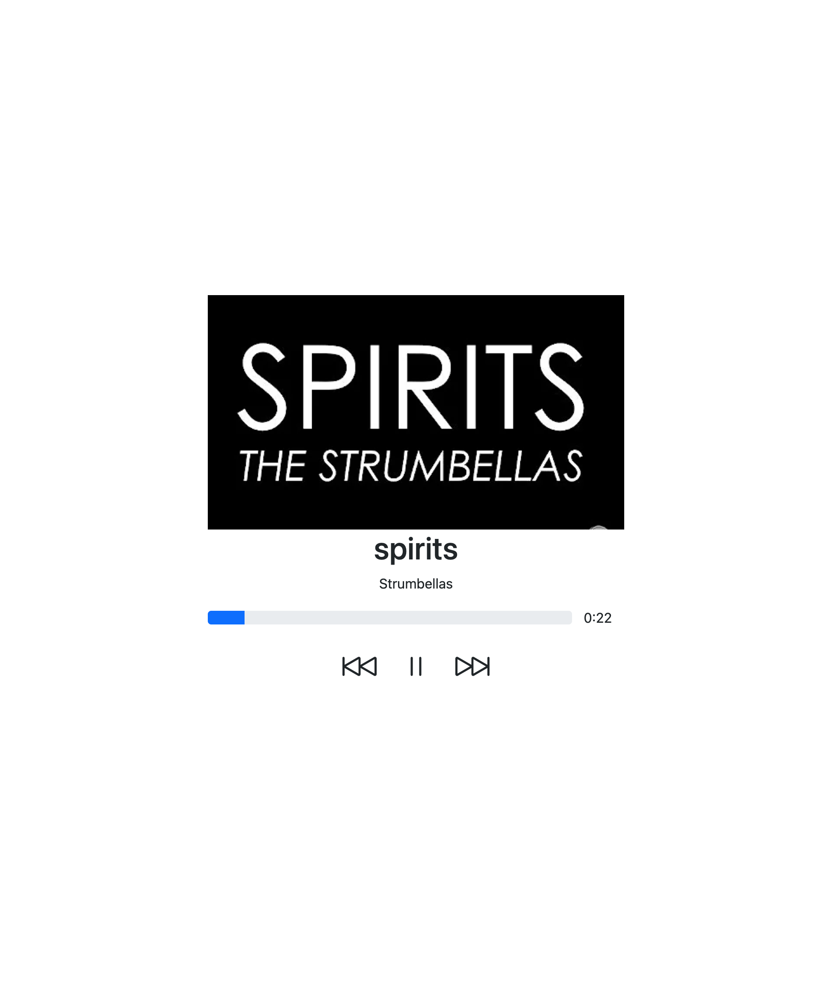

# Music Player
A simple music player react.js 

## What I have learn
* `useRef` hook in react.js
* Bootstrap css

## Running locally
clone the repository using and install the dependencies 

`yarn start` to start the app

## screenshots

